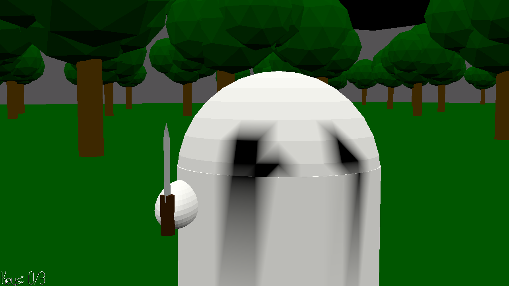

# The game in which a ghost tries to stab you

Author: Jesse Liu

Design: A simple first-person game in which the player must find three keys to unlock a door and escape, all while being chased by a ghost with a knife. The ghost is invisible unless it's extremely close to the player, but it's still possible to track its position because it won't stop monologuing.

Screen Shot:

How To Play:

Use the WASD keys to move, and the mouse to look around. Press ESC to unlock the mouse, and left-click to lock it again. Picking up keys and opening doors (if possible) is done automatically on contact.

This game was built with [NEST](NEST.md).
locked.wav, stab.wav, and stab-ghost.wav were recorded and edited on https://audiomass.co/
pickup.wav and win.wav were created on https://jfxr.frozenfractal.com/